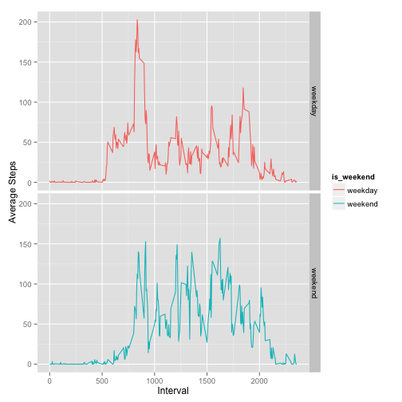
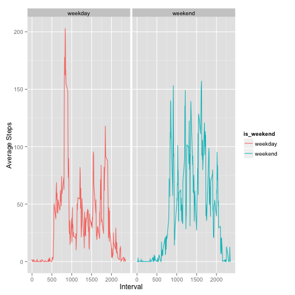

## Setting Global preferences

```r
library(knitr)
opts_chunk$set(echo=TRUE)
```

## Loading and preprocessing the data

### Loading raw data
1. Raw data should be saved into "activity.csv"
2. "activity.csv" file should be located in current working directory

**NOTE:** Raw data was loaded into "raw_data" object


```r
raw_data <- read.csv("./activity.csv")
summary(raw_data)
```

```
##      steps                date          interval     
##  Min.   :  0.00   2012-10-01:  288   Min.   :   0.0  
##  1st Qu.:  0.00   2012-10-02:  288   1st Qu.: 588.8  
##  Median :  0.00   2012-10-03:  288   Median :1177.5  
##  Mean   : 37.38   2012-10-04:  288   Mean   :1177.5  
##  3rd Qu.: 12.00   2012-10-05:  288   3rd Qu.:1766.2  
##  Max.   :806.00   2012-10-06:  288   Max.   :2355.0  
##  NA's   :2304     (Other)   :15840
```

### Preprocessing raw data
- clean data was stored into "data" object


```r
data <- raw_data[complete.cases(raw_data),]
nrow(data)
```

```
## [1] 15264
```


## What is mean total number of steps taken per day?

Will aggregate data using "ddply" module grouping data by "date" column and generating daily means

### Loading "plyr" package and calculating daily total


### Plotting histogram

```r
hist(daily_total$daily_total, main="Daily Steps Frequency", xlab="Steps")
```

 

### Calculating mean

```r
daily_mean <- mean(daily_total$daily_total)
print(daily_mean)
```

```
## [1] 10766.19
```

### Calculating median

```r
daily_mean <- median(daily_total$daily_total)
print(daily_mean)
```

```
## [1] 10765
```

## What is the average daily activity pattern?

### Aggregating 5-min steps across all days and ploting a time series

```r
interval_mean <- ddply(data, .(interval), summarize, interval_mean=mean(steps))
plot(interval_mean$interval, interval_mean$interval_mean, type="l", main="Average daily activity pattern", ylab="Average Steps", xlab="Interval")
```

 

### Finding which 5-minute interval, on average across all the days in the dataset, contains the maximum number of steps

```r
interval_mean[interval_mean$interval_mean==max(interval_mean$interval_mean),"interval"]
```

```
## [1] 835
```

## Imputing missing values
Filling in all of the missing values in the dataset with interval average across all days taking wekday/weekend into condsideration

### Calculate t the total number of missing values in the dataset (i.e. the total number of rows with NAs)

```r
nrow(raw_data[is.na(raw_data$steps),])
```

```
## [1] 2304
```

### Adding "is_weekend" column to datatasets with missing/without missing step count

```r
raw_data$is_weekend <- apply(raw_data, 1, function(row) if(as.POSIXlt(row[2])$wday == 0 || as.POSIXlt(row[2])$wday == 6) "weekend" else "weekday")
data$is_weekend <- apply(data, 1, function(row) if(as.POSIXlt(row[2])$wday == 0 || as.POSIXlt(row[2])$wday == 6) "weekend" else "weekday")
```

### Aggregating 5-min steps across all days taking weekend into consideration

```r
interval_mean_weekend <- ddply(data, .(is_weekend,interval), summarize, interval_mean=mean(steps))
```

### Defining "fix_missing" function and using it to populate missing step counts

```r
fix_missing <- function(row){
       value <- interval_mean_weekend[(interval_mean_weekend$is_weekend == row[4] & interval_mean_weekend$interval == row[3]), "interval_mean"]
       if(length(value)>0) return(value) else return(0)
}
```

### Creating a new dataset that is equal to the original dataset but with the missing steps count filled in.

```r
raw_data_nomissing <- raw_data
raw_data_nomissing[is.na(raw_data_nomissing$steps), "steps"] <- apply(raw_data_nomissing[is.na(raw_data_nomissing$steps),], 1, fix_missing)
summary(raw_data_nomissing)
```

```
##      steps                date          interval       is_weekend       
##  Min.   :  0.00   2012-10-01:  288   Min.   :   0.0   Length:17568      
##  1st Qu.:  0.00   2012-10-02:  288   1st Qu.: 588.8   Class :character  
##  Median :  0.00   2012-10-03:  288   Median :1177.5   Mode  :character  
##  Mean   : 35.46   2012-10-04:  288   Mean   :1177.5                     
##  3rd Qu.: 19.15   2012-10-05:  288   3rd Qu.:1766.2                     
##  Max.   :806.00   2012-10-06:  288   Max.   :2355.0                     
##                   (Other)   :15840
```

### Plotting histogram with missing steps count filled in

```r
daily_total <- ddply(raw_data_nomissing, .(date), summarize, daily_total=sum(steps))
hist(daily_total$daily_total, main="Daily Steps Frequency", xlab="Steps")
```

 

### Calculating mean with missing steps count filled in

```r
daily_mean <- mean(daily_total$daily_total)
print(daily_mean)
```

```
## [1] 10213.84
```

### Calculating median with missing steps count filled in

```r
daily_mean <- median(daily_total$daily_total)
print(daily_mean)
```

```
## [1] 10395
```

## Are there differences in activity patterns between weekdays and weekends?

### Aggregating 5-min steps across all days and ploting a time series

```r
library(ggplot2)
interval_mean <- ddply(raw_data_nomissing, .(is_weekend,interval), summarize, interval_mean=mean(steps))
ggplot() + geom_line(data = interval_mean, aes(x = interval, y = interval_mean, color = is_weekend)) +
        facet_grid(is_weekend ~ .)+
        ylab("Average Steps") +
        xlab("Interval")
```

 

**NOTE: ** Although GigHUB example was showing vertical panels I find that horizintal pannels(*below*) make it easie to compare weekends vs weekdays


```r
library(ggplot2)
interval_mean <- ddply(raw_data_nomissing, .(is_weekend,interval), summarize, interval_mean=mean(steps))
ggplot() + geom_line(data = interval_mean, aes(x = interval, y = interval_mean, color = is_weekend)) +
        facet_grid(. ~ is_weekend)+
        ylab("Average Steps") +
        xlab("Interval")
```

 

Generated on Thu Nov 13 11:56:57 2014 

from /Users/vstoyak/Documents/CourseraClasses/ReproducibleResearch/RepData_PeerAssessment1/activity.csv
